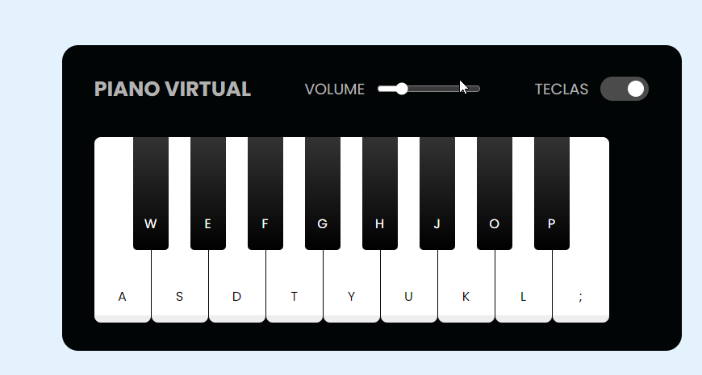

# Simulador-de-Piano-com-JavaScript
> Desafio DIO - Criando um Simulador de Piano com JavaScript

## 📋 Índice
- [Link do projeto:](https://finandolopes.github.io/Simulador_de_Piano/)

- [📖 Sobre](#-Sobre)
- [🚀 Tecnologias utilizadas](#-Tecnologias-utilizadas)
- [🖥 Preview](#-Preview)

## 📖 Sobre
Projeto desenvolvido durante o Bootcamp [Potência Tech iFood - Desenvolvimento de Jogos](https://web.dio.me/track/potencia-tech-ifood-desenvolvimento-de-jogos) Aqui o objetivo é criar um Simulador de piano virtual em Javascript.

## 🚀 Tecnologias utilizadas
- Javascript - CSS - HTML

## 🖥 Preview:

  

